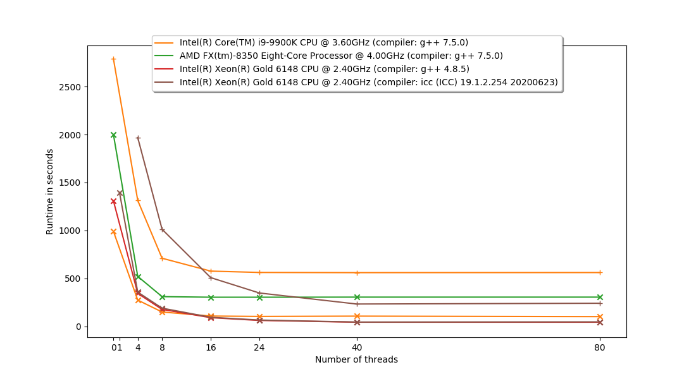

# SimpleRayTracing

A simple ray-tracer used as an example of application for my HPC module.

Runtime in seconds on GNU/Linux openSUSE using g++ (SUSE Linux) 7.5.0 using two processors:

| Model name:        | AMD FX(tm)-8350 Eight-Core Processor | Intel(R) Core(TM) i9-9900K CPU @ 3.60GHz |
|--------------------|--------------------------------------|------------------------------------------|
| CPU MHz:           | 4000.000                             | 4900.956                                 |
| CPU max MHz:       | 4000.0000                            | 5000.0000                                |
| CPU min MHz:       | 1400.0000                            | 800.0000                                 |
| L1d cache:         | 16K                                  | 32K                                      |
| L1i cache:         | 64K                                  | 32K                                      |
| L2 cache:          | 2048K                                | 256K                                     |
| L3 cache:          | 8192K                                | 16384K                                   |
| NUMA node0 CPU(s): | 0-7                                  | 0-15                                     |

| Processor:                                      | Release date | Parallelisation     | Release | Debug |
|-------------------------------------------------|--------------|---------------------|---------|-------|
| Intel(R) Core(TM) i9-9900K CPU @ 3.60GHz        | Q4 2018      | None                | 992     |       |
| Intel(R) Core(TM) i9-9900K CPU @ 3.60GHz        | Q4 2018      | OpenMP (4 threads)  | 275     | 563   |
| Intel(R) Core(TM) i9-9900K CPU @ 3.60GHz        | Q4 2018      | OpenMP (8 threads)  | 151     | 577   |
| Intel(R) Core(TM) i9-9900K CPU @ 3.60GHz        | Q4 2018      | OpenMP (16 threads) | 109     |       |
| Intel(R) Core(TM) i9-9900K CPU @ 3.60GHz        | Q4 2018      | OpenMP (24 threads) | 105     |       |
| AMD FX(tm)-8350 Eight-Core Processor @ 4.00GHz  | Q4 2012      | None                |         |       |
| AMD FX(tm)-8350 Eight-Core Processor @ 4.00GHz  | Q4 2012      | OpenMP (4 threads)  |         |       |
| AMD FX(tm)-8350 Eight-Core Processor @ 4.00GHz  | Q4 2012      | OpenMP (8 threads)  |         |       |
| AMD FX(tm)-8350 Eight-Core Processor @ 4.00GHz  | Q4 2012      | OpenMP (16 threads) |         |       |
| AMD FX(tm)-8350 Eight-Core Processor @ 4.00GHz  | Q4 2012      | OpenMP (24 threads) |         |       |

